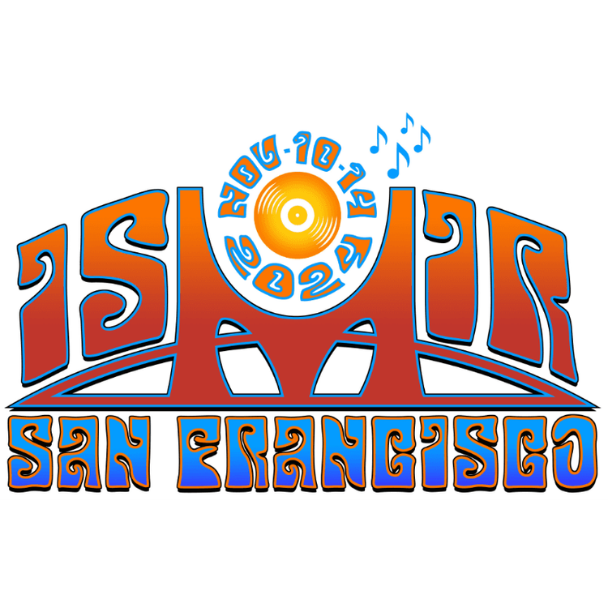

# ISMIR-2024-Papers

  
  

---
**Under construction**

ISMIR 2024 Papers: A complete collection of influential and exciting research papers from the [*ISMIR 2024*](https://ismir2024.ismir.net/) conference. Explore the latest advances in Music information retrieval. Code included. :star:

    

 -b31b1b) %20*-1D7FBF)

> :point_right: `*` This count includes repositories on GitHub, GitLab, Hugging Face, and distributions on PyPI, while excluding Web Page or GitHub Page links.

---

[*The PDF version of the ISMIR 2023 Conference Programme*](https://ismir2023.ismir.net/assets/img/detailed_schedule.pdf), comprises a list of all accepted full papers, their presentation order, as well as the designated presentation times.

---

<a href="https://github.com/DmitryRyumin/NewEraAI-Papers" style="float:left;">
  
  Other collections of the best AI conferences
</a>

 
 

> :exclamation: Conference table will be up to date all the time.

<table>
    <tr>
        <td><strong>Conference</strong></td>
        <td colspan="1" align="center"><strong>Year</strong></td>
    </tr>
    <tr>
      <td colspan="2" align="center"><i>Computer Vision (CV)</i></td>
    </tr>
    <tr>
        <td>CVPR</td>
        <td align="center"><a href="https://github.com/DmitryRyumin/CVPR-2023-Papers" target="_blank">2023</a></td>
    </tr>
    <tr>
        <td>ICCV</td>
        <td align="center"><a href="https://github.com/DmitryRyumin/ICCV-2023-Papers" target="_blank">2023</a></td>
    </tr>
    <tr>
      <td colspan="2" align="center"><i>Speech/Signal Processing (SP/SigProc)</i></td>
    </tr>
    <tr>
        <td>ICASSP</td>
        <td align="center"><a href="https://github.com/DmitryRyumin/ICASSP-2023-Papers" target="_blank">2023</a></td>
    </tr>
    <tr>
        <td>INTERSPEECH</td>
        <td align="center"><a href="https://github.com/DmitryRyumin/INTERSPEECH-2023-Papers" target="_blank">2023</a></td>
    </tr>
</table>

---

## Contributors

 
 

Contributions to improve the completeness of this list are greatly appreciated. If you come across any overlooked papers, please **feel free to [*create pull requests*](https://github.com/yamathcy/ISMIR-2023-Papers/pulls), [*open issues*](https://github.com/yamathcy/ISMIR-2023-Papers/issues) or contact me via [*email*](mailto:yyamamoto13044aa@gmail.com)**. Your participation is crucial to making this repository even better.

---

## [Tutorials](https://ismir2024.ismir.net/tutorials/)

<!-- | **Title** | **Material** |
|--------|:---------:|
|[Analysing Physiological Data Collected During Music Listening: An Introduction](https://ismir2023.ismir.net/tutorials/#1-analysing-physiological-data-collected-during-music-listening-an-introduction)||
|[Introduction to Differentiable Audio Synthesizer Programming](https://ismir2023.ismir.net/tutorials/#2-introduction-to-differentiable-audio-synthesizer-programming)||
|[Transformer-based Symbolic Music Generation: Fundamentals to Advanced Concepts, Stylistic Considerations, Conditioning Mechanisms and Large Language Models](https://ismir2023.ismir.net/tutorials/#3-transformer-based-symbolic-music-generation-fundamentals-to-advanced-concepts-stylistic-considerations-conditioning-mechanisms-and-large-language-models)||
|[Computer-Assisted Music-Making Systems: Taxonomy, Review, and Coding](https://ismir2023.ismir.net/tutorials/#4-computer-assisted-music-making-systems-taxonomy-review-and-coding)|:heavy_minus_sign:|
|[Learning with Music Signals: Technology Meets Education](https://ismir2023.ismir.net/tutorials/#5-learning-with-music-signals-technology-meets-education)|:heavy_minus_sign:|
|[Kymatio: Deep Learning Meets Wavelet Theory for Music Signal Processing](https://ismir2023.ismir.net/tutorials/#6-kymatio-deep-learning-meets-wavelet-theory-for-music-signal-processing)||
--- -->
| **Title** | **Material** |
|--------|:---------:|
|[Connecting Music Audio and Natural Language](https://ismir2023.ismir.net/tutorials/#1-analysing-physiological-data-collected-during-music-listening-an-introduction)|:heavy_minus_sign:|
|[Exploring 25 Years of Music Information Retrieval: Perspectives and Insights](https://ismir2023.ismir.net/tutorials/#2-introduction-to-differentiable-audio-synthesizer-programming)|:heavy_minus_sign:|
|[From White Noise to Symphony: Diffusion Models for Music and Sound](https://ismir2023.ismir.net/tutorials/#3-transformer-based-symbolic-music-generation-fundamentals-to-advanced-concepts-stylistic-considerations-conditioning-mechanisms-and-large-language-models)|:heavy_minus_sign:|
|[Humans at the Center of MIR: Human-subjects Research Best Practices](https://ismir2023.ismir.net/tutorials/#4-computer-assisted-music-making-systems-taxonomy-review-and-coding)|:heavy_minus_sign:|
|[Deep Learning 101 for Audio-based MIR](https://ismir2023.ismir.net/tutorials/#5-learning-with-music-signals-technology-meets-education)|:heavy_minus_sign:|
|[Lyrics and Singing Voice Processing in Music Information Retrieval: Analysis, Alignment, Transcription and Applications](https://ismir2023.ismir.net/tutorials/#6-kymatio-deep-learning-meets-wavelet-theory-for-music-signal-processing)|:heavy_minus_sign:|

## [Papers](https://ismir2023.ismir.net/)

<!-- > :exclamation: Final paper links will be added post-conference. -->

List of sessions

- [ISMIR-2024-Papers](#ismir-2024-papers)
  - [Contributors](#contributors)
  - [Tutorials](#tutorials)
  - [Papers](#papers)
    - [Session 1](#session-1)
    - [Session 2](#session-2)
    - [Session 3](#session-3)
    - [Session 4](#session-4)
    - [Session 5](#session-5)
    - [Session 6](#session-6)
    - [Session 7](#session-7)
    - [Late-Breaking Demo](#late-breaking-demo)
  - [Star History](#star-history)

<!--  -->

### Session 1

  

| **Title** | **Repo** | **Paper** |
|-----------|:--------:|:---------:|
| [Formal Modeling of Structural Repetition using Tree Compression](https://ismir2024.ismir.net/) | :heavy_minus_sign: |  |
| [Saraga Audiovisual: a large multimodal open data collection for the analysis of Carnatic Music](https://ismir2024.ismir.net/) | :heavy_minus_sign: |  |
| [X-Cover: Better music version identification system by integrating pretrained ASR model](https://ismir2024.ismir.net/) | :heavy_minus_sign: |  |
| [Harmonic and Transposition Constraints Arising from the Use of the Roland TR-808 Bass Drum](https://ismir2024.ismir.net/) | :heavy_minus_sign: |  |
| [FruitsMusic: A Real-World Corpus of Japanese Idol-Group Songs](https://ismir2024.ismir.net/) | :heavy_minus_sign: |  |
| [Classical Guitar Duet Separation using GuitarDuets - a Dataset of Real and Synthesized Guitar Recordings](https://ismir2024.ismir.net/) | :heavy_minus_sign: |  |
| [Can LLMs "Reason" in Music? An Evaluation of LLMs' Capability of Music Understanding and Generation](https://ismir2024.ismir.net/) | :heavy_minus_sign: |  |
| [Music2Latent: Consistency Autoencoders for Latent Audio Compression](https://ismir2024.ismir.net/) | :heavy_minus_sign: |  |
| [Robust and Accurate Audio Synchronization Using Raw Features From Transcription Models](https://ismir2024.ismir.net/) | :heavy_minus_sign: |  |
| [Selective Annotation of Few Data for Beat Tracking of Latin American Music Using Rhythmic Features](https://ismir2024.ismir.net/) | :heavy_minus_sign: |  |
| [Harnessing the Power of Distributions: Probabilistic Representation Learning on Hypersphere for Multimodal Music Information Retrieval](https://ismir2024.ismir.net/) | :heavy_minus_sign: |  |
| [Towards Automated Personal Value Estimation in Song Lyrics](https://ismir2024.ismir.net/) | :heavy_minus_sign: |  |
| [Audio Conditioning for Music Generation via Discrete Bottleneck Features](https://ismir2024.ismir.net/) | :heavy_minus_sign: |  |
| [Variation Transformer: New datasets, models, and comparative evaluation for symbolic music variation generation](https://ismir2024.ismir.net/) | :heavy_minus_sign: |  |
| [Automatic Detection of Moral Values in Music Lyrics](https://ismir2024.ismir.net/) | :heavy_minus_sign: |  |
| [Semi-Supervised Piano Transcription Using Pseudo-Labeling Techniques](https://ismir2024.ismir.net/) | :heavy_minus_sign: |  |
| [Note-Level Transcription of Choral Music](https://ismir2024.ismir.net/) | :heavy_minus_sign: |  |
| [Learning Multifaceted Self-Similarity over Time and Frequency for Music Structure Analysis](https://ismir2024.ismir.net/) | :heavy_minus_sign: |  |
| [A Contrastive Self-Supervised Learning scheme for beat tracking amenable to few-shot learning](https://ismir2024.ismir.net/) | :heavy_minus_sign: |  |
| [Using Pairwise Link Prediction and Graph Attention Networks for Music Structure Analysis](https://ismir2024.ismir.net/) | :heavy_minus_sign: |  |

### Session 2

  

| **Title** | **Repo** | **Paper** |
|-----------|:--------:|:---------:|
| [Six Dragons Fly Again: Reviving 15th-Century Korean Court Music with Transformers and Novel Encoding](https://ismir2024.ismir.net/) | :heavy_minus_sign: |  |
| [Lessons learned from a project to encode Mensural music on a large scale with Optical Music Recognition](https://ismir2024.ismir.net/) | :heavy_minus_sign: |  |
| [The Changing Sound of Music: An Exploratory Corpus Study of Vocal Trends Over Time](https://ismir2024.ismir.net/) | :heavy_minus_sign: |  |
| [Music Proofreading with RefinPaint: Where and How to Modify Compositions given Context](https://ismir2024.ismir.net/) | :heavy_minus_sign: |  |
| [Notewise Evaluation of Source Separation: A Case Study For Separated Piano Tracks](https://ismir2024.ismir.net/) | :heavy_minus_sign: |  |
| [Automatic Estimation of Singing Voice Musical Dynamics](https://ismir2024.ismir.net/) | :heavy_minus_sign: |  |
| [Joint Audio and Symbolic Audio Conditioning For Temporally Controlled Text-to-Music Generation](https://ismir2024.ismir.net/) | :heavy_minus_sign: |  |
| [DIFF-A-RIFF: MUSICAL ACCOMPANIMENT CO-CREATION VIA LATENT DIFFUSION MODELS](https://ismir2024.ismir.net/) | :heavy_minus_sign: |  |
| [Exploring Internet Radio Across the Globe with the MIRAGE Online Dashboard](https://ismir2024.ismir.net/) | :heavy_minus_sign: |  |
| [The Sound Demixing Challenge 2023 – Cinematic Demixing Track](https://ismir2024.ismir.net/) | :heavy_minus_sign: |  |
| [MIDI-to-Tab: Guitar Tablature Inference via Masked Language Modeling](https://ismir2024.ismir.net/) | :heavy_minus_sign: |  |
| [Transcription-based lyrics embeddings: simple extraction of effective lyrics embeddings from audio](https://ismir2024.ismir.net/) | :heavy_minus_sign: |  |
| [A Method for MIDI Velocity Estimation for Piano Performance by a U-Net with Attention and FiLM](https://ismir2024.ismir.net/) | :heavy_minus_sign: |  |
| [MusiConGen: Rhythm and Chord Control for Transformer-Based Text-to-Music Generation](https://ismir2024.ismir.net/) | :heavy_minus_sign: |  |
| [End-to-end Piano Performance-MIDI to Score Conversion with Transformers](https://ismir2024.ismir.net/) | :heavy_minus_sign: |  |
| [From Real to Cloned Singer Identification](https://ismir2024.ismir.net/) | :heavy_minus_sign: |  |
| [Emotion-driven Piano Music Generation via Two-stage Disentanglement and Functional Representation](https://ismir2024.ismir.net/) | :heavy_minus_sign: |  |
| [EFFICIENT ADAPTER TUNING FOR JOINT SINGING VOICE BEAT AND DOWNBEAT TRACKING WITH SELF-SUPERVISED LEARNING FEATURES](https://ismir2024.ismir.net/) | :heavy_minus_sign: |  |
| [Which audio features can predict the dynamic musical emotions of both composers and listeners?](https://ismir2024.ismir.net/) | :heavy_minus_sign: |  |
| [Exploring Musical Roots: Applying Audio Embeddings to Empower Influence Attribution for a Generative Music Model](https://ismir2024.ismir.net/) | :heavy_minus_sign: |  |

### Session 3

  

| **Title** | **Repo** | **Paper** |
|-----------|:--------:|:---------:|
| [Green MIR? Investigating computational cost of recent music-Ai research in ISMIR](https://ismir2024.ismir.net/) | :heavy_minus_sign: |  |
| [Field Study on Children's Home Piano Practice: Developing a Comprehensive System for Enhanced Student-Teacher Engagement](https://ismir2024.ismir.net/) | :heavy_minus_sign: |  |
| [Inner Metric Analysis as a Measure of Rhythmic Syncopation](https://ismir2024.ismir.net/) | :heavy_minus_sign: |  |
| [Human-AI Music Process: A Dataset of AI-Supported Songwriting Processes from the AI Song Contest](https://ismir2024.ismir.net/) | :heavy_minus_sign: |  |
| [Cue Point Estimation using Object Detection](https://ismir2024.ismir.net/) | :heavy_minus_sign: |  |
| [The ListenBrainz Listens Dataset](https://ismir2024.ismir.net/) | :heavy_minus_sign: |  |
| [SpecMaskGIT: Masked Generative Modelling of Audio Spectrogram for Efficient Audio Synthesis and Beyond](https://ismir2024.ismir.net/) | :heavy_minus_sign: |  |
| [Long-form music generation with latent diffusion](https://ismir2024.ismir.net/) | :heavy_minus_sign: |  |
| [Composer's Assistant 2: Interactive Multi-Track MIDI Infilling with Fine-Grained User Control](https://ismir2024.ismir.net/) | :heavy_minus_sign: |  |
| [Piano Concerto Dataset (PCD): A Multitrack Dataset of Piano Concertos](https://ismir2024.ismir.net/) | :heavy_minus_sign: |  |
| [Towards Zero-Shot Amplifier Modeling: One-to-Many Amplifier Modeling via Tone Embedding Control](https://ismir2024.ismir.net/) | :heavy_minus_sign: |  |
| [Mel-RoFormer for Vocal Separation and Vocal Melody Transcription](https://ismir2024.ismir.net/) | :heavy_minus_sign: |  |
| [Unsupervised Synthetic-to-Real Adaptation for Optical Music Recognition](https://ismir2024.ismir.net/) | :heavy_minus_sign: |  |
| [MMT-BERT: Chord-aware Symbolic Music Generation Based on Multitrack Music Transformer and MusicBERT](https://ismir2024.ismir.net/) | :heavy_minus_sign: |  |
| [Discogs-VI: A Musical Version Identification Dataset Based on Public Editorial Metadata](https://ismir2024.ismir.net/) | :heavy_minus_sign: |  |
| [WHO'S AFRAID OF THE `ARTYFYSHALL BYRD'? HISTORICAL NOTIONS AND CURRENT CHALLENGES OF MUSICAL ARTIFICIALITY](https://ismir2024.ismir.net/) | :heavy_minus_sign: |  |
| [End-to-end automatic singing skill evaluation using cross-attention and data augmentation for solo singing and singing with accompaniment](https://ismir2024.ismir.net/) | :heavy_minus_sign: |  |

### Session 4

  

| **Title** | **Repo** | **Paper** |
|-----------|:--------:|:---------:|
| [Cluster and Separate: a GNN Approach to Voice and Staff Prediction for Score Engraving](https://ismir2024.ismir.net/) | :heavy_minus_sign: |  |
| [From Audio Encoders to Piano Judges: Benchmarking Performance Understanding for Solo Piano](https://ismir2024.ismir.net/) | :heavy_minus_sign: |  |
| [Towards Explainable and Interpretable Musical Difficulty Estimation: A Parameter-efficient Approach](https://ismir2024.ismir.net/) | :heavy_minus_sign: |  |
| [Purposeful Play: Evaluation and Co-Design of Casual Music Creation Applications with Children](https://ismir2024.ismir.net/) | :heavy_minus_sign: |  |
| [El Bongosero: A Crowd-sourced Symbolic Dataset of Improvised Hand Percussion Rhythms Paired with Drum Patterns](https://ismir2024.ismir.net/) | :heavy_minus_sign: |  |
| [Utilizing Listener-Provided Tags for Music Emotion Recognition: A Data-Driven Approach](https://ismir2024.ismir.net/) | :heavy_minus_sign: |  |
| [PiCoGen2: Piano cover generation with transfer learning approach and weakly aligned data](https://ismir2024.ismir.net/) | :heavy_minus_sign: |  |
| [Diff-MST: Differentiable Mixing Style Transfer](https://ismir2024.ismir.net/) | :heavy_minus_sign: |  |
| [Semi-Supervised Contrastive Learning of Musical Representations](https://ismir2024.ismir.net/) | :heavy_minus_sign: |  |
| [A Dataset of Larynx Microphone Recordings for Singing Voice Reconstruction](https://ismir2024.ismir.net/) | :heavy_minus_sign: |  |
| [Improved symbolic drum style classification with grammar-based hierarchical representations](https://ismir2024.ismir.net/) | :heavy_minus_sign: |  |
| [Nested Music Transformer: Sequentially Decoding Compound Tokens in Symbolic Music and Audio Generation](https://ismir2024.ismir.net/) | :heavy_minus_sign: |  |
| [Continual Learning for Music Classification](https://ismir2024.ismir.net/) | :heavy_minus_sign: |  |
| [TheGlueNote: Learned Representations for Robust and Flexible Note Alignment](https://ismir2024.ismir.net/) | :heavy_minus_sign: |  |
| [GAPS: A Large and Diverse Classical Guitar Dataset and Benchmark Transcription Model](https://ismir2024.ismir.net/) | :heavy_minus_sign: |  |
| [A Kalman Filter model for synchronization in musical ensembles](https://ismir2024.ismir.net/) | :heavy_minus_sign: |  |
| [Stem-JEPA: A Joint-Embedding Predictive Architecture for Musical Stem Compatibility Estimation](https://ismir2024.ismir.net/) | :heavy_minus_sign: |  |
| [Audio Prompt Adapter: Unleashing Music Editing Abilities for Text-to-Music with Lightweight Finetuning](https://ismir2024.ismir.net/) | :heavy_minus_sign: |  |
| [MelodyT5: A Unified Score-to-Score Transformer for Symbolic Music Processing](https://ismir2024.ismir.net/) | :heavy_minus_sign: |  |
| [GraphMuse: A Library for Symbolic Music Graph Processing](https://ismir2024.ismir.net/) | :heavy_minus_sign: |  |

### Session 5

  

| **Title** | **Repo** | **Paper** |
|-----------|:--------:|:---------:|
| [ST-ITO: Controlling audio effects for style transfer with inference-time optimization](https://ismir2024.ismir.net/) | :heavy_minus_sign: |  |
| [ComposerX: Multi-Agent Music Generation with LLMs](https://ismir2024.ismir.net/) | :heavy_minus_sign: |  |
| [Do Music Generation Models Encode Music Theory?](https://ismir2024.ismir.net/) | :heavy_minus_sign: |  |
| [PolySinger: Singing-Voice to Singing-Voice Translation from English to Japanese](https://ismir2024.ismir.net/) | :heavy_minus_sign: |  |
| [On the validity of employing ChatGPT for distant reading of music similarity](https://ismir2024.ismir.net/) | :heavy_minus_sign: |  |
| [Sanidha: A Studio Quality Multi-Modal Dataset for Carnatic Music](https://ismir2024.ismir.net/) | :heavy_minus_sign: |  |
| [Between the AI and Me: Analysing Listeners' Perspectives on AI- and Human-Composed Progressive Metal Music](https://ismir2024.ismir.net/) | :heavy_minus_sign: |  |
| [Combining audio control and style transfer using latent diffusion](https://ismir2024.ismir.net/) | :heavy_minus_sign: |  |
| [Computational Analysis of Yaredawi YeZema Silt in Ethiopian Orthodox Tewahedo Church Chants](https://ismir2024.ismir.net/) | :heavy_minus_sign: |  |
| [Wagner Ring Dataset: A Complex Opera Scenario for Music Processing and Computational Musicology](https://ismir2024.ismir.net/) | :heavy_minus_sign: |  |
| [Lyrics Transcription for Humans: A Readability-Aware Benchmark](https://ismir2024.ismir.net/) | :heavy_minus_sign: |  |
| [A Critical Survey of Research in Music Genre Recognition](https://ismir2024.ismir.net/) | :heavy_minus_sign: |  |
| [Content-based Controls for Music Large-scale Language Modeling](https://ismir2024.ismir.net/) | :heavy_minus_sign: |  |
| [Exploring the inner mechanisms of large generative music models](https://ismir2024.ismir.net/) | :heavy_minus_sign: |  |
| [Quantitative Analysis of Melodic Similarity in Music Copyright Infringement Cases](https://ismir2024.ismir.net/) | :heavy_minus_sign: |  |
| [Robust lossy audio compression identification](https://ismir2024.ismir.net/) | :heavy_minus_sign: |  |
| [RNBert: Fine-Tuning a Masked Language Model for Roman Numeral Analysis](https://ismir2024.ismir.net/) | :heavy_minus_sign: |  |

### Session 6

  

| **Title** | **Repo** | **Paper** |
|-----------|:--------:|:---------:|
| [MuChoMusic: Evaluating Music Understanding in Multimodal Audio-Language Models](https://ismir2024.ismir.net/) | :heavy_minus_sign: |  |
| [Human Pose Estimation for Expressive Movement Descriptors in Vocal Musical Performance](https://ismir2024.ismir.net/) | :heavy_minus_sign: |  |
| [Enhancing predictive models of music familiarity with EEG: Insights from fans and non-fans of K-pop group NCT127](https://ismir2024.ismir.net/) | :heavy_minus_sign: |  |
| [Mosaikbox: Improving Fully Automatic DJ Mixing Through Rule-based Stem Modification And Precise Beat-Grid Estimation](https://ismir2024.ismir.net/) | :heavy_minus_sign: |  |
| [MidiCaps: A Large-scale MIDI Dataset with Text Captions](https://ismir2024.ismir.net/) | :heavy_minus_sign: |  |
| [A New Dataset, Notation Software, and Representation for Computational Schenkerian Analysis](https://ismir2024.ismir.net/) | :heavy_minus_sign: |  |
| [DITTO-2: Distilled Diffusion Inference-Time T-Optimization for Music Generation](https://ismir2024.ismir.net/) | :heavy_minus_sign: |  |
| [The Concatenator: A Bayesian Approach To Real Time Concatenative Musaicing](https://ismir2024.ismir.net/) | :heavy_minus_sign: |  |
| [DEEP RECOMBINANT TRANSFORMER: ENHANCING LOOP COMPATIBILITY IN DIGITAL MUSIC PRODUCTION](https://ismir2024.ismir.net/) | :heavy_minus_sign: |  |
| [Repertoire-Specific Vocal Pitch Data Generation for Improved Melodic Analysis of Carnatic Music](https://ismir2024.ismir.net/) | :heavy_minus_sign: |  |
| [I can listen but cannot read: An evaluation of two-tower multimodal systems for instrument recognition](https://ismir2024.ismir.net/) | :heavy_minus_sign: |  |
| [Streaming Piano Transcription Based on Consistent Onset and Offset Decoding with Sustain Pedal Detection](https://ismir2024.ismir.net/) | :heavy_minus_sign: |  |
| [Towards Universal Optical Music Recognition: A Case Study on Notation Types](https://ismir2024.ismir.net/) | :heavy_minus_sign: |  |
| [Controlling Surprisal in Music Generation via Information Content Curve Matching](https://ismir2024.ismir.net/) | :heavy_minus_sign: |  |
| [Toward a More Complete OMR Solution](https://ismir2024.ismir.net/) | :heavy_minus_sign: |  |
| [Augment, Drop & Swap: Improving Diversity in LLM Captions for Efficient Music-Text Representation Learning](https://ismir2024.ismir.net/) | :heavy_minus_sign: |  |
| [Music Discovery Dialogue Generation Using Human Intent Analysis and Large Language Model](https://ismir2024.ismir.net/) | :heavy_minus_sign: |  |
| [STONE: Self-supervised tonality estimator](https://ismir2024.ismir.net/) | :heavy_minus_sign: |  |
| [Beat this! Accurate beat tracking without DBN postprocessing](https://ismir2024.ismir.net/) | :heavy_minus_sign: |  |
| [The Sound Demixing Challenge 2023 – Music Demixing Track](https://ismir2024.ismir.net/) | :heavy_minus_sign: |  |

### Session 7

  

| **Title** | **Repo** | **Paper** |
|-----------|:--------:|:---------:|
| [Scoring Time Intervals Using Non-Hierarchical Transformer for Automatic Piano Transcription](https://ismir2024.ismir.net/) | :heavy_minus_sign: |  |
| [CADENZA: A Generative Framework for Expressive Musical Ideas and Variations](https://ismir2024.ismir.net/) | :heavy_minus_sign: |  |
| [Looking for Tactus in All the Wrong Places: Statistical Inference of Metric Alignment in Rap Flow](https://ismir2024.ismir.net/) | :heavy_minus_sign: |  |
| [Exploring GPT's Ability as a Judge in Music Understanding](https://ismir2024.ismir.net/) | :heavy_minus_sign: |  |
| [Towards Assessing Data Replication in Music Generation with Music Similarity Metrics on Raw Audio](https://ismir2024.ismir.net/) | :heavy_minus_sign: |  |
| [Generating Sample-Based Musical Instruments Using Neural Audio Codec Language Models](https://ismir2024.ismir.net/) | :heavy_minus_sign: |  |
| [HIERARCHICAL GENERATIVE MODELING OF THE MELODIC VOICE IN HINDUSTANI CLASSICAL MUSIC](https://ismir2024.ismir.net/) | :heavy_minus_sign: |  |
| [SymPAC: Scalable Symbolic Music Generation With Prompts And Constraints](https://ismir2024.ismir.net/) | :heavy_minus_sign: |  |
| [Unsupervised Composable Representations for Audio](https://ismir2024.ismir.net/) | :heavy_minus_sign: |  |
| [CCOM-HuQin: An Annotated Multimodal Chinese Fiddle Performance Dataset](https://ismir2024.ismir.net/) | :heavy_minus_sign: |  |
| [Lyrically Speaking: Exploring the Link Between Lyrical Emotions, Themes and Depression Risk](https://ismir2024.ismir.net/) | :heavy_minus_sign: |  |
| [A Stem-Agnostic Single-Decoder System for Music Source Separation Beyond Four Stems](https://ismir2024.ismir.net/) | :heavy_minus_sign: |  |
| [In-depth performance analysis of the ADTOF-based algorithm for automatic drum transcription](https://ismir2024.ismir.net/) | :heavy_minus_sign: |  |
| [Towards Musically Informed Evaluation of Piano Transcription Models](https://ismir2024.ismir.net/) | :heavy_minus_sign: |  |
| [Using Item Response Theory to Aggregate Music Annotation Results of Multiple Annotators](https://ismir2024.ismir.net/) | :heavy_minus_sign: |  |
| [Just Label the Repeats for In-The-Wild Audio-to-Score Alignment](https://ismir2024.ismir.net/) | :heavy_minus_sign: |  |
| [Investigating Time-Line-Based Music Traditions with Field Recordings: A Case Study of Candomblé Bell Patterns](https://ismir2024.ismir.net/) | :heavy_minus_sign: |  |
| [PiJAMA: Piano Jazz with Automatic MIDI Annotations](https://ismir2024.ismir.net/) | :heavy_minus_sign: |  |

### Late-Breaking Demo

  

| **Title** | **Repo** | **Paper** |
|-----------|:--------:|:---------:|
| [Title](https://ismir2024program.ismir.net) | :heavy_minus_sign: |  |

---

## Star History

    

